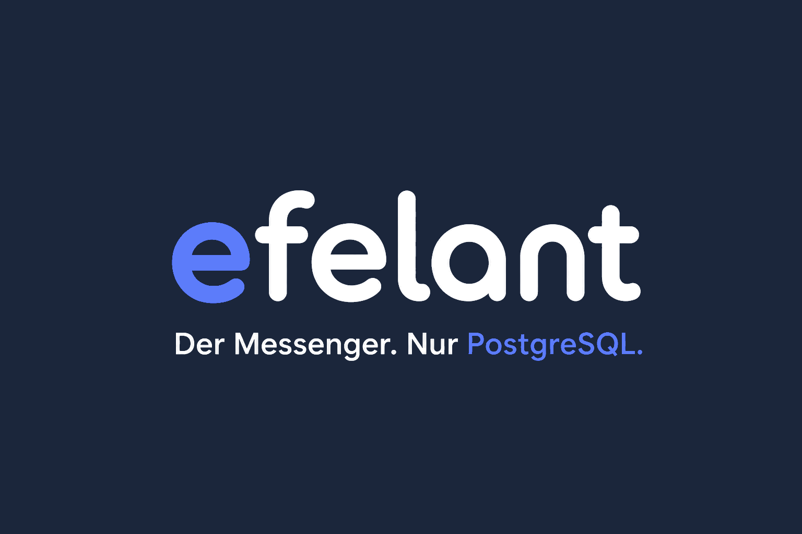

<p align="center">
  
</p>

<h1 align="center">efelant</h1>

<p align="center">
  <strong>The communication layer for PostgreSQL applications.</strong><br />
  A messenger and an embeddable conversation layer. Core is SQL.<br />
  There is no application server.
</p>

<p align="center">
  <a href="https://github.com/tafaust/efelant">GitHub</a> ·
  <a href="docs/README.md">Docs</a> ·
  <a href="site/index.html">Website</a> ·
  <a href="docs/api.md">API</a> ·
  <a href="docs/repository.md">Repository</a> ·
  <a href="packages/README.md">Packages</a> ·
  <a href="LICENSE">AGPL-3.0</a>
</p>

---

Most chat stacks add Redis, Kafka, and an application server before the first message lands. Efelant is built for people who already have PostgreSQL and want conversations, activity feeds, and status events to live next to the data they already trust.

## Features

- 🐘 **PostgreSQL is the API** — stored functions, RLS, LISTEN/NOTIFY. No Node, Nest, FastAPI, or GraphQL in Core.
- 💬 **Messenger and embeddable layer** — standalone chat, or a thread next to a ticket, claim, or order.
- 🔐 **Keys stay on the device** — X25519 + AES-GCM. PostgreSQL stores ciphertext, never private keys.
- 🌐 **Web without an app server** — nginx or Caddy serves Flutter web; `/ws` is a protocol adapter only.
- 🔌 **REST and gRPC as extensions** — `efelant_rest` and `efelant_grpc` call the same SQL as native clients.
- 🎨 **Style Dictionary tokens** — one command writes CSS, JS, Dart, Stencil, and the marketing site.
- 🧩 **SDKs you can regenerate** — TypeScript, bundled JS, Stencil `<efelant-*>`, Flutter facades.
- 🚀 **Zero extra runtime** — if Compose works on your machine, so does Efelant.

## Get started

```bash
cp .env.example .env
./scripts/up.sh
```

Open [http://localhost:8080](http://localhost:8080). The browser talks same-origin `ws://localhost:8080/ws`.

| username | password    |
| -------- | ----------- |
| alice    | password123 |
| bob      | password123 |
| charlie  | password123 |

Seeded only on first init when `EFELANT_SEED=1` (the default in `.env.example`). Self-host with `EFELANT_SEED=0` and use **create an account**.

Native Flutter (optional):

```bash
asdf install          # Flutter from .tool-versions
cd app && flutter run
```

Android emulator host is usually `10.0.2.2` instead of `localhost`:

```bash
flutter run --dart-define=EFELANT_DB_HOST=10.0.2.2
```

## Design tokens, components, SDKs

Need Node 20+. From the repository root:

```bash
./scripts/packages.sh
```

That is the whole pipeline: Style Dictionary → TypeScript / JS clients → Stencil → Flutter facades.

| you want | command |
| -------- | ------- |
| Style Dictionary only | `./scripts/packages.sh tokens` |
| `@efelant/client` + JS bundle | `./scripts/packages.sh clients` |
| `<efelant-*>` + Flutter widgets | `./scripts/packages.sh components` |

Edit `packages/tokens/tokens/*.json` and `packages/web-components/src/`. Generated CSS, Dart, and `dist/` are outputs — do not hand-edit them.

Full map: [packages/README.md](packages/README.md).

## Self-host

Run it on hardware or a VM you control. Paths: Docker, Compose, Swarm, Helm, or Kustomize. Full steps: [docs/deployment.md](docs/deployment.md).

```bash
./scripts/new-secrets.sh
# edit .env: EFELANT_DOMAIN=chat.example.com
#            EFELANT_WS_ORIGINS=https://chat.example.com
docker compose -f docker-compose.yml -f docker-compose.caddy.yml up -d --build
```

Caddy obtains TLS for `EFELANT_DOMAIN` and reverse-proxies the web client. Postgres is not published. Users register in the app. Do not ship the development passwords.

Traefik overlay: `docker-compose.traefik.yml`. Swarm: tag GHCR images to the Compose names, then `docker stack deploy`. Kubernetes: `helm install` from `oci://ghcr.io/tafaust/efelant/charts/efelant` or `kubectl apply -k deploy/kustomize/overlays/{dev,prod,prod-no-stackgres}`. GHCR tags: `0`, `0.1`, `0.1.0`, `latest`.

## Tests

```bash
docker compose up -d --build
./database/tests/run.sh
cd app && flutter test
```

## Repository

```text
efelant/
├── app/                 Flutter messenger
├── database/            Core SQL, extensions, web-gateway, tests
├── packages/            tokens · clients · Stencil · Flutter SDK
├── site/                landing + HTML docs
├── deploy/              nginx, Caddy, Traefik, Helm, Kustomize
├── docs/                markdown source of truth
└── scripts/             up, migrate, secrets, packages
```

How the folders fit together: [docs/repository.md](docs/repository.md).  
Architecture, security, function API: [docs/core.md](docs/core.md).

## Where to look

| | |
| --- | --- |
| 📚 **Docs** | [docs/](docs/README.md) |
| 🌐 **Website** | [site/](site/index.html) |
| 🎨 **Tokens & SDKs** | [docs/styles.md](docs/styles.md) · [docs/sdk.md](docs/sdk.md) · [packages/](packages/README.md) |
| 🚀 **Commands** | [scripts/](scripts/README.md) |
| 🔌 **REST / gRPC** | [docs/api.md](docs/api.md) |
| 🚢 **Self-host** | [docs/deployment.md](docs/deployment.md) |

---

## License

[GNU Affero General Public License v3.0 or later](https://choosealicense.com/licenses/agpl-3.0/). Full text: [LICENSE](LICENSE). Details: [docs/license.md](docs/license.md).

<p align="center">
  Using Efelant? <a href="docs/use-cases.md">Read the use cases</a> and tell a colleague.
</p>
